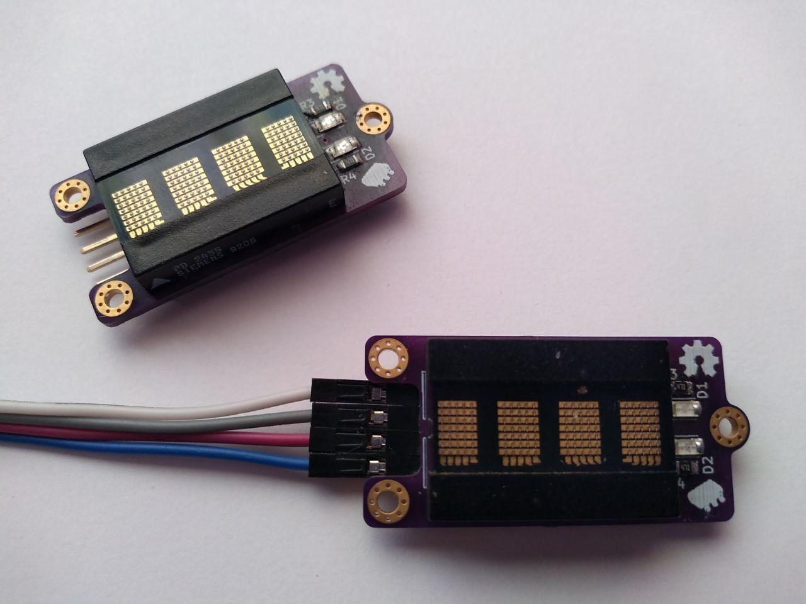
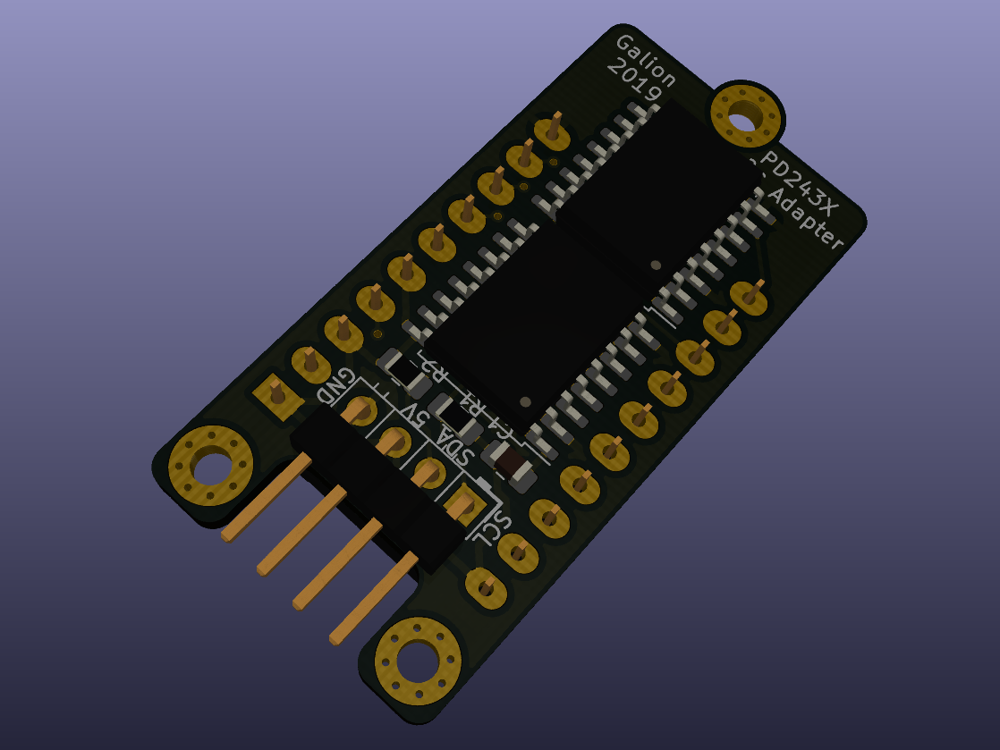

# PD243X I²C Display Adapter Board

This repository contains KiCad design files, schematics and gerber files for a simple adapter board that allows to use old PD2435, PD2436 and PD2437 dot-matrix displays with most microcontrollers using I²C protocol instead of pin-consuming  parallel interface. They can be used as neat little displays for any project that requires some kind of simple and old-looking display.

## Photo (more in `images` folder)

## Details
PD245x displays are small four-digit alphanumeric dot-matrix displays. They use 8-bit data bus, 3-bit address line and additional signals to receive data from microcontroller. Because parallel interface requires many I/O pins to work, a simple I²C adapter board was designed. It uses 2 PCF8574T ICs to control all required pins of the display.

## Compatibility

This adapter board was designed with PD2435 in mind but it's working also with other color variants. According to the datasheet Also PD323X and PD443X displays can be used but probably they won't fit on this PCB as nicely as PD243X. 

## Bill of materials

- *1x*: PD243X display
- *1x*: 4 pin single row right angled header with 2.54mm pin spacing
- *2x*: PFC8574 I²C expander in SOIC-16 package
- *1x*: 100nF capacitor in 0805 SMD package
- *2x*: 4.7k ohm resisttor in 0805 SMD package
- *2x*: 470 ohm resisttor in 0805 SMD package
- *1x*: Green LED in 1206 SMD package
- *1x*: Red LED in 1206 SMD package

## License

[Solderpad Hardware Licence Version 2.0](LICENSE.md)

## Author
[Galion](galion$AT$sdf.org)
